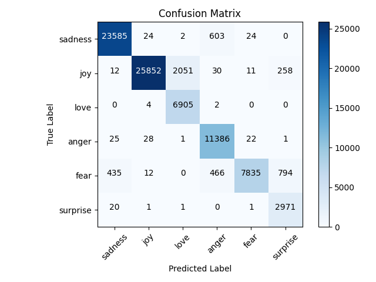
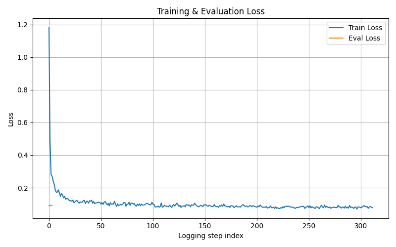
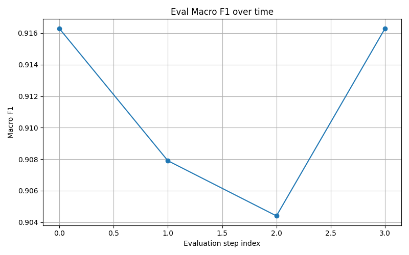
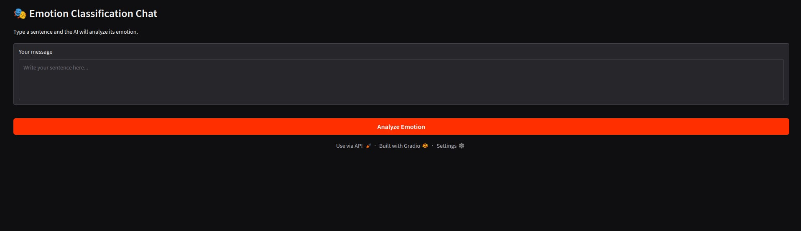
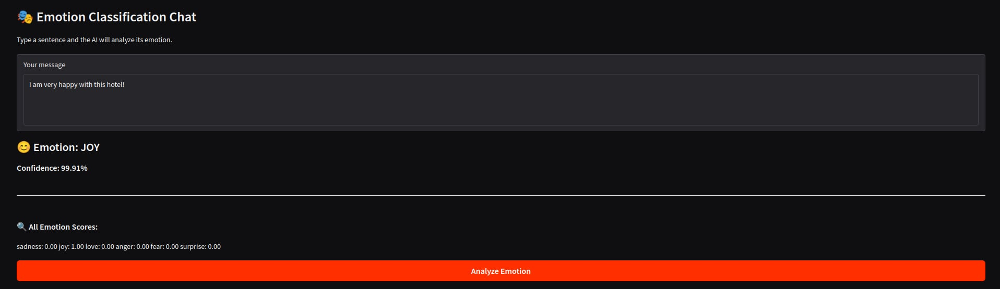
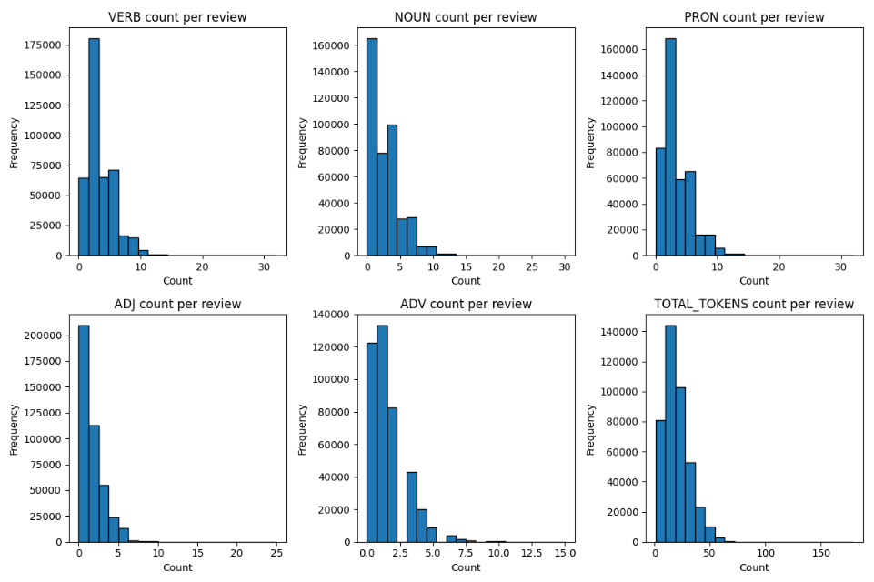

# Emotion Detection in Customer Feedback

## Project Information
- Institution: University of Pristina "Hasan Prishtina"
- Faculty: Faculty of Eletrical and Computer Engineering
- Program: Master's Degree, Computer and Software Engineering
- Subject: Natural Language Processing (NLP)      
- Professor: Prof. Dr. Sc. Mërgim H. HOTI
  
  

  

## Authors

- [Albin Hashani](https://github.com/AlbinHashanii)
- [Arjana Tërnava](https://github.com/ArjanaaTernava)
- [Erza Osmani](https://github.com/erzaosmani)

## About the project

This project trains a multi-class emotion detection model using DistilBERT to classify text into six emotional categories:
sadness, joy, love, anger, fear, and surprise.
The full training pipeline includes:

- Data loading and preprocessing
- Model fine-tuning with Hugging Face Transformers
- Evaluation with accuracy & macro-F1
- Confusion matrix & learning curve visualization
- Model saving and inference testing
- Interactive webpage for predicting emotions

## Project structure

- `data/`  
  Contains dataset used for training, validation, and testing.

- `images/`  
  Stores images or visualizations, such as sample inputs, graphs, or diagrams.

- `models/`  
  Directory for saving trained models.

- `results/`  
  Stores evaluation metrics, predictions, or logs.

- `src/`  
  Main source code directory.

  - `src/data/loader.py`  
    Handles loading datasets, preprocessing data, splitting datasets.

  - `src/evaluation/metrics.py`  
    Implements model evaluation metrics like accuracy, F1-score, precision, recall.

  - `src/evaluation/pos.py`  
    Handles Part-of-Speech (POS) summary per emotion.

  - `src/model/builder.py`  
    Defines deep learning model, including architecture and layer setup.

  - `src/training/training.py`  
    Contains the training loop: feeding data to the model.

  - `src/ui/app.py`  
    Implements the user interface for interacting with the model.

  - `src/utils/logging.py`  
    Provides standardized logging.

  - `src/main.py`  
    Main entry point of the project.

## Dataset information

This dataset is sourced from [Hugging Face](https://huggingface.co/datasets/dair-ai/emotion) contains a total of 439806  rows and 2 columns: `text and label`.

## Development Environment

- This project is developed in a python environment and as a coding editor the PyCharm editor was used.
- In order for the execution to complete faster we recommend the execution to be GPU based and not CPU based.
- The training on our end was conducted on the following machine:
  - Lenovo Legion 5 with the GPU: Nvidia RTX 2060
  
- Instructions:
    - Download and install PyCharm Editor
    - Select Pure Python for the project type
    - If you don't have an interpreter set up, you can do it in the editor based on instructions.
    - Install the required packages.

## Required Libraries    
- torch
- transformers
- datasets
- pandas
- numpy
- scikit-learn
- matplotlib
- spacy
- openpxyl
- collections

## Emotion Labels
`{
  "sadness": 0,
  "joy": 1,
  "love": 2,
  "anger": 3,
  "fear": 4,
  "surprise": 5
}`
- This mapping is saved automatically as:
`label_mapping.json`
## Model & Training Configuration 

| Settings               | Value                                                                                        |
| ------------------ | -----------------------------------------------------------------------------------------------    |
| **Model**        | distilbert-base-uncased.                                                                            |
| **Max Token Length** | 128                                                 |
| **Epochs**    | 3                                                  |
| **Learning Rate**   | 2e-5                                                           |
| **Train Batch Size**  | 16                             |
| **Eval Batch Size**   | 32 |
| **Evaluation Metric**   | Macro F1|
| **Optimizer**   | AdamW (via Trainer)

- The best model is automatically selected based on Macro-F1 score.
      
## Evaluation Outputs
After training, the following are automatically generated:
- Metrics - saved to `metrics.json`. They include `Accuracy, Macro F1 Score and Evaluation loss`.
- Classification Report saved to `classification_report.txt` and it includes `Precision, Recall, F1 Score, Support for each class`.
- Confusion Matrix - Visual `confusion_matrix.png` and Numeric `confusion_matrix.json`. 
- Learning Curves - Training & evaluation loss `loss_curve.png` and Evaluation macro-F1 `f1_curve.png`.

## Model Saving
- The trained model and tokenizer are saved to: `preprocess-3-epochs-bert-model/model/`.
- This folder can be reused directly for inference or deployment.

## Interference and Testing 
- After training, the script runs automatic prediction tests on sample sentences such as: 
`"The hotel completely messed up my reservation..."`

`"I felt happy for the first time."`

`"All day I felt alone and rejected..."`

NOTE: This part is only done for testing purposes. In order to see how the model performs with every sentence that a user gives, we have created an interactive UI.

## Logging
- All console output is saved to: `logs.txt`.
- This includes:
    - Training progress
    - Evaluation results
    - Classification report
    - Test predictions

## Results & Output Files Explanation
- This section explains the evaluation results produced by the best-performing model after 3 training epochs.

- `metrics.json` - This file contains the overall evaluation metrics of the model on the unseen test set.
- Key Results:
    - Test Accuracy: 94.21%.
    - Macro F1-Score: 91.63%
    - Evaluation Loss: 0.091
    - Test Samples: 83,362 sentences

These results confirm that the model generalizes very well and maintains strong balanced performance across all emotion classes. The high Macro F1-score shows that the model does not favor only majority classes.

- `classification_report.txt` - Detailed Per-Class Performance: This file shows precision, recall, and F1-score for each emotion class.
- Class-wise Interpretation:

| Emotion  | Precision | Recall | F1-score | Interpretation |
|----------|-----------|--------|----------|----------------|
| Sadness  | 0.98      | 0.97   | 0.98     | Very accurate and consistent |
| Joy      | 1.00      | 0.92   | 0.96     | Extremely precise but slightly confused with love |
| Love     | 0.77      | 0.99   | 0.87     | High recall but some confusion with joy |
| Anger    | 0.91      | 0.99   | 0.95     | Very reliable detection |
| Fear     | 0.99      | 0.82   | 0.90     | High precision, moderate confusion with surprise |
| Surprise | 0.74      | 0.99   | 0.85     | High recall but weaker precision |

- Overall Scores:
    - Overall Accuracy: 94.21%.
    - Macro Avg F1: 91.63%.
    - Weighted Avg F1: 94.33%.
- This confirms that the model performs strongly across all emotional categories.

- `confusion_matrix.png` - Error Distribution Visualization: This image shows how often each emotion is confused with others.

- Key Observations:
    - Sadness → Anger: Some misclassification occurs due to shared negative emotional tone.
    - Joy → Love: Frequent confusion because many joyful texts contain affectionate language.
    - Fear → Surprise: Overlap occurs due to similar emotional reactions.
    - Surprise & Love: Lower precision caused by semantic similarity with joy and fear.
- Overall, the confusion matrix confirms that most predictions fall correctly on the diagonal, meaning correct classification.

- `loss_curve.png` - Training & Evaluation Loss: This plot shows how the model’s loss changed during training.
- Interpretation:
    - Training loss rapidly decreases at the start, showing fast learning.
    - Loss stabilizes around 0.08–0.10, indicating good convergence.
    - Evaluation loss remains low and stable, confirming no overfitting.
This confirms that the model trained efficiently and reached a stable optimum.

  

- `f1_curve.png` - Macro F1 Across Epochs: This plot tracks how Macro F1-score changed over evaluation steps.
- Observed Trend:
    - Epoch 1: Highest F1 ≈ 0.916.
    - Epoch 2: Slight drop due to regularization.
    - Epoch 3: Stable recovery ≈ 0.916
The best model was selected using Macro F1, ensuring balanced performance across classes.
  

- `model/` - Final Deployed Model
- This directory contains: 
    - Fine-tuned DistilBERT weights understanding emotional language.
    - Tokenizer configuration.
    - Ready for:
        - API deployment
        - Web applications
        - Mobile applications
        - Batch processing

## User Interface 
The User Interface enables the user to write any prompt that contains specific emotions and to predict them successfully.

The images below shows how the UI looks:

  

  

## POS - Part of Speech
- It describes the role a word plays in a sentence. The results are saved into this file: 
`results/pos_counts_per_review.csv`
- The image below shows the POS count for nouns, pronouns, verbs, adverbs and adjectives.

### License

[Apache-2.0](http://www.apache.org/licenses/)
